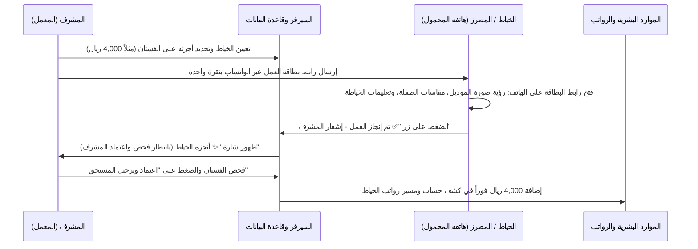

# 🧵 خطة بناء منظومة الربط الذكي بين خطوط الإنتاج وأجور الخياطين وبطاقة العمل الإلكترونية (Tailor Job Card & Mobile Portal)

خطة هندسية وتطبيقية متكاملة لتحويل معمل **Little Princesses** إلى مشغل ذكي غير ورقي (Paperless Smart Atelier) يربط:
1. **أجور وعمولات الخياطين والمطرزين بالقطعة (Piece-Rate Wage & Commissions).**
2. **إصدار بطاقة أمر التشغيل الإلكترونية الذكية للخياط (`job_card.html`).**
3. **إرسال رابط البطاقة والمقاسات مباشرة إلى واتساب الخياط أو عبر رسالة SMS بضغطة زر واحدة.**
4. **تأكيد إنجاز العمل من هاتف الخياط وإشعار المشرف لاعتماد الفستان وترحيل المستحقات المالية فوراً إلى قسم الموارد البشرية والرواتب (HR).**

---

## 🎯 دورة العمل التشغيلية الذكية (Smart Atelier Workflow)

---

## 🏗️ مكونات التنفيذ البرمجية والهندسية

### 1. بطاقة أمر التشغيل الإلكترونية المتجاوبة للهواتف (`job_card.html`) [NEW]
* صفحة ويب خفيفة وسريعة ومصممة خصيصاً للهواتف الذكية (Mobile-First UI):
  - **رأس البطاقة:** شعار دار أميرات الصغار، كود الطلب (`PO-XXXX`)، وتاريخ التسليم المطلوب.
  - **بطاقة الموديل:** صورة الفستان المعتمد، اسم الموديل، ولون القماش المخصص.
  - **مواصفات ومقاسات الأميرة:** عرض مقاسات الطفلة الحقيقية (طول الفستان، محيط الصدر، الخصر، الكتف، الرقبة...) بالوحدة المختارة (إنش أو سم).
  - **تعليمات المشغل وتفضيلات الراحة:** نوع السحاب، البطانة الناعمة، تفادي حساسية التل، إلخ.
  - **الاستحقاق المالي للخياط:** عرض أجرة/عمولة الفستان بوضوح (مثال: `4,000 ريال يمني`).
  - **زر التفاعل السريع:**
    زر كبير مضيء: **«✅ أتممت الخياطة / العمل جاهز للفحص»**.
    عند الضغط عليه، يتم تحديث حالة الطلب إلى `جاهز للفحص`، ويفتح خيار إشعار المشرف عبر واتساب.

### 2. محرك توليد روابط ورسائل الواتساب الذكية (`Factory.jsx`)
* في جدول وبطاقات أوامر الإنتاج:
  - زر إرسال مباشر: **`📲 إرسال للخياط عبر واتساب`**.
  - توليد رابط واتساب مباشر (`https://wa.me/{phone}?text=...`) برقم هاتف الخياط المخزن في قسم HR.
  - نص الرسالة المنسق تلقائياً:
    > 👑 *دار أميرات الصغار للأزياء الراقية*
    > أهلاً بك يا {اسم الخياط}، لديك أمر تشغيل جديد:
    > 👗 الفستان: *{اسم الموديل}*
    > 👧 للأميرة: *{اسم الطفلة}*
    > 💰 أجرة العمل: *{أجرة الخياطة} ريال*
    > 📅 موعد التسليم المطلوب: *{تاريخ التسليم}*
    > 🔗 اضغط على الرابط لمعاينة صورة الموديل والمقاسات بدقة:
    > {رابط بطاقة التشغيل}

### 3. إسناد الأجرة والعمولة في خطوط الإنتاج (`Factory.jsx` & `pg_service.py`)
* إضافة حقل **«أجرة / عمولة الخياط (Piece Wage)»** في بطاقة إسناد أمر التشغيل (مع اقتراح تلقائي بناءً على الموديل أو الراتب المسجل للخياط).
* تخزين حقول:
  - `tailor_wage`: أجر الخياط عن هذا الفستان.
  - `tailor_status`: حالة عمل الخياط (`قيد التنفيذ`، `أنجزه الخياط`، `معتمد`).
  - `wage_credited`: هل تم ترحيل المبلغ لحساب الخياط في HR.

### 4. محطة اعتماد المشرف وترحيل المستحقات المالية إلى HR (`HR.jsx` & `pg_service.py`)
* عندما يضغط الخياط على اكتمال العمل:
  - تظهر شارة في شاشة المعمل: **«✨ بانتظار اعتماد المشرف»**.
* المشرف يضغط: **«✅ فحص واعتماد وترحيل المستحق»**:
  - ترحيل مستحقات الخياط تلقائياً إلى جدول كشوفات وأجور الموظفين في `HR`.
  - في شاشة `HR.jsx`: يظهر في ملف الخياط كشف تفصيلي بالأعمال المنجزة (رقم الطلب، اسم الفستان، التاريخ، والمبلغ المستحق) ومجموع عمولاته المستحقة للصرف.

---

## 🧪 خطة التحقق والتشغيل الفعلي (Verification Plan)
1. **اختبار صفحة `job_card.html`:** فتح البطاقة على المتصفح ومحاكاة عرض الموبايل والتأكد من ظهور مقاسات الطفلة وصورة الموديل وأجرة الخياط بدقة.
2. **اختبار زر تفاعل الخياط:** الضغط على زر "تم إنجاز العمل" والتأكد من تحديث حالة السجل في قاعدة بيانات PostgreSQL.
3. **اختبار توليد رابط الواتساب:** التحقق من صحة صياغة نص الرسالة والرابط المشفر ومطابقة رقم هاتف الخياط.
4. **اختبار ترحيل المستحقات المالية إلى HR:** التأكد من إضافة أجرة الفستان المعتمد في رصيد الخياط في قسم الموارد البشرية والرواتب.
